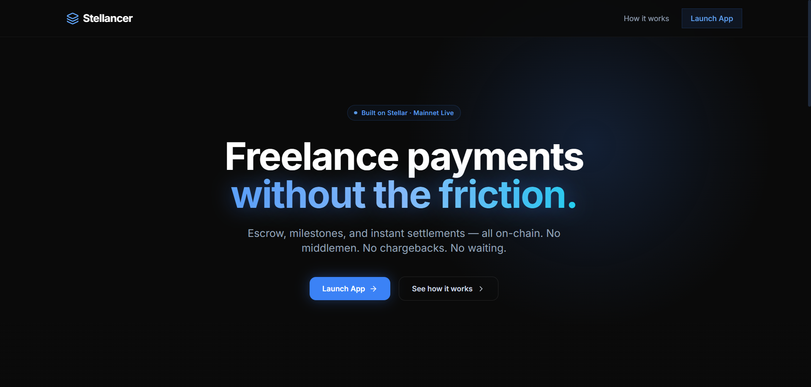
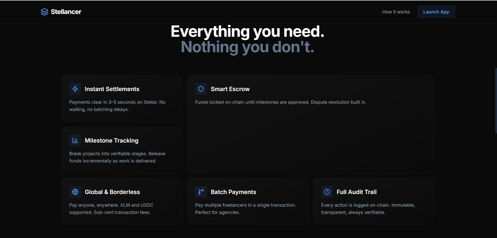
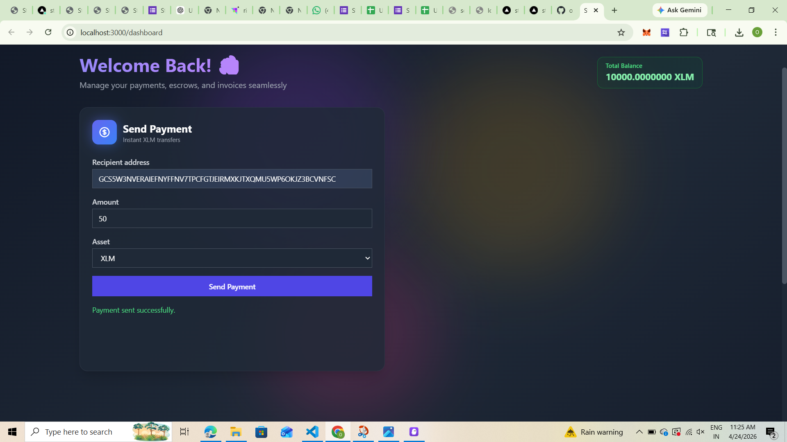

# 🚀 Stellar Freelance Platform

A decentralized freelance payment platform built on the Stellar blockchain, featuring instant payments, milestone-based escrow, and real-time activity tracking.

## 🌐 Live Demo

**🔗 [View Live Demo](http://stellarfreelance.vercel.app/)**

Deployed on Vercel | [Give Feedback](https://stellar-freelance-q3mulgcmt-omkarjagtap2105-designs-projects.vercel.app)

## 🎥 Video Demo

https://github.com/user-attachments/assets/your-video-id


## 🖼️ Screenshots

### Landing Page


### Hero Page


### Dashboard


*Send payments to multiple recipients and generate professional PDF invoices*

---


## 🧪 Test Wallet Addresses

Use these test wallet addresses to explore the platform on Stellar Testnet. All addresses are verifiable on [Stellar Expert](https://stellar.expert/explorer/testnet).

User Name	User Wallet Address	User Email	User Feedback	Commit ID
Aiman Momin	GAIXT2BHVEVSXQN7ERT4SBZFKJ35FKJR2LUADLFVHJI7MI7D6WJ42NDE	aimanmomin999@gmail.com	A tiny free quota or credits could make adoption easier	f8f91bb
KARTIK BOTRE	GBHA2H7RRFAE5QINGF3BLSZGLPEBTM5EW7A547PJ4E26L4Z7MMLAOJEE	kartikbotre2410@gmail.com	Image generator Feature is absolutely accurate	f8f91bb
Spandan Tulse	GDNK4HM6E2EUC7SSXQ3C5JVQYWAB5IZ4GNMHJ5XRBKD4DZKBJN34D3V5	spandy205@gmail.com	Summariser Feature is very useful	f8f91bb
neel pote	GBKLRBXJFBC7SFNZ6PWM5WRHKEOD3PONHYE4UY2N6NJEF3BNS2KU65SV	neelpote44@gmail.com	option to genrate multiple images at once	f8f91bb
Sarthak Dhere	GCRYPAQB3TFLQE727TA3R723QIEPTP5KCMP7OMH4HVXNLCEUKPD4AZJP	sarthakdhere0217@gmail.com	no there where no bugs	f8f91bb
Viru Shelke	GD5II5CFYRMH6ZNL33K3BT74T4WMXRG6EMGPUIEUAXRKUKVQ3A5ZTAPB	indravardhan10@gmail.com	Could improve the landing page insights	f8f91bb
Chirag Pardeshi	GCCIMBD7AHY2WFUV7GXJ37DAVYO2FXK2OIDARUVS4RQRIOUY2ZTQTBKG	chiragpardeshi493@gmail.com	nice ui preferred	ebcc575
Dhruva Mandavkar	GA5LFJFRZ6356U2UB37NQGOCZJVLF42FZETM3OMPTP2EZ2QQUFCICQBF	dhruvamandavkar10@gmail.com	A resume analysis checker that checks and rates your resume.	ebcc575
Shubham Bhosale	GAOJPUXIQQBK4SVA4RYQ2MUKHAUUHHJDFQFHYAYY6M4LO7ULDJO7PXXR	shubhambhosale9833@gmail.com	Could add more documents formats for ai analysis	ebcc575
Omkar Jagtap	GALPMWKLCNINAXN6L6Z5MOS2Y2Z4BFTP3MQDUX4A22VAL3WBV3BLQVX3	omkarjagtap2105@gmail.com	add a more informative ui	ebcc575
Sarthak Kshirsagar	GCCGWE7UVX6W746FFYD55THU2KM4XOT2EJGFRZK4K5KISZDUAIN7VDZG	kshirsagarsarthak9@gmail.com	PDF tool helps summarize better than anyother tools online	7f85400
Aniket Bhilare	GABAKQPPTWRW6QDR7WSNVXO3QA67B3O5EG6P75SOPQK7GATBFRRR3GFS	bhilareaniket2424@gmail.com	A single wallet signing feature where multiple tools can be used for a limited time or amount.	7f85400
Thanchan Bhumij	GCZYQCKPUBOHOL5VONWJOLHNULLTBE5YR7KRH2OK6LZAO4EL6S2QZXYZ	thanchanb@gmail.com	add better navigation	7f85400
Shantanu Udhane	GBLAKFNA2MGGK2F6SCPTEWL3HSI7G4CK4BL6XOFTNPHALXMPECLQKP2F	udhaneshantanu@gmail.com	a security page should be added telling users about how secure the dapp is.	7f85400
yash annadate	GCFPZLS4FSNHSD5HKVMES2Y26XCLTD3BO2G6EY2NQT4JHGYW6GWTQSJX	yashannadate2005@gmail.com	options to choose from multiple models for various tools	7f85400
Kapil Shisodiya	GA367DTGT5S5UZSFN4M24SWL2OOXYFX5PDFNFRN5ORC4UIAKG3VHBPU5	kapilshisodiya1308@gmail.com	need a better about section	7f85400
Purvai Naik	GB5OKLSWWQIMG4BQCA7QKMOTAVYTZ5KUV7B62LROPEYRPYGUGWRCRKG4	purvai1246@gmail.com	needs a how to use	7f85400
Khushi Shinde	GDUVJHIQJ2MPCUGI2XLDSON6PS5Q4CW2ADOP2BXVZYWS3LHXAAH2LLC7	shindekhushi892003@gmail.com	add more features	7f85400
Atharva bamble	GCYFYUN6Y7PWXVTBMFGBAGZ6MKD2LIOHKRQUGZLXULYTDJVJZFCES72B	atharvabamble@gmail.com	tracking your limits should be added	5f757f6
Akansha patil	GCU3MRFMKVSV6I6UVEICCS4TON3WA2YNO7URCENEMI7BBE4GLSNYORIX	akankshapatil2099@gmail.com	Add a logo for recognition	5f757f6
NEEV AGRAWAL	GD3M2PRHPNWTEV6INIYKDNTE3MWQJ3RWCA6JVG433EQ3ID6MDPYPN7W2	neevagrawal328@gmail.com	Add a light and dark theme	5f757f6
Tejashwi Kasture	GDQRLHQH7OZJI3OJ5HUL7DWGOTFRW734QC3EYJOMET5MVBLTQI4VGRXT	kasturetejaswhi@gmail.com	add more document formats for tools like pdf analyzer	5f757f6
Atharva Shinde	GAC2SOG32Y62BBQCFUTDJSVFJRVMKATMYKPLSBUJFYPN27KYQ5U6IKCT	satharvashinde7551@gmail.com	give some free tokens to users	5f757f6
Atharva Koyte	GCPN4OERNLJEXQXNZJ3SMA6PA7EVK5EPQ3IEX22CXX4BXS2FVNOVJ34L	atharva.koyte@mitwpu.edu.in	Needs a good ui	cabc079
Akshay Awasthy	GARBOAAO2N7WD47ILMIEDJGVQQZDY2TUNUDIGBQHGPPNPEA7GX7MYUGP	akshayawasthy83@gmail.com	needs better logic for escrow handling	cabc079
Sneha Pathak	GDCUYJNELLBR7AN7OB4D56VDCBLBPQIKYUBECQOYMSD3VONNE7NRMITH	sneha.pathak@gmail.com	more auth login	cabc079
Meera Joshi	GBRGGGVT2IBQUW7CQMTTZWVBGQT7YJM5KLKGQWXJ7OCGY7NZXLIKLUDX	meera.joshi.pune@gmail.com	extra tools	4504988
Samar Kudale	GD7GH6UJRV373QNY2YXGURQS7U5KL44MSIENJVKXHIJDKLTTUGUIP6BL	samarkudale3@gmail.com	frontend needs better ui	4504988
Ronit Wadkar	GCXGTYYJKJOO6ARFWSIFWWLRP2OOH77Y3JLPF3RI7WZ7IHPXBNMHS6JM	ronitwadkar68@gmail.com	summarizing bullet points tool	e6b8267
Rajesh Das	GC22MRKOZK4V7MWH2ARTGNSIFSUSB2GOAZVZ3HZGW3U2ACS5GJVIDL3Y	rajeshdas81@gmail.com	An about section	98f97f5
Dhruv Patnekar	GAITQAFXKSZSZCZMTRZUQC4I7IQWBRWH4QZ5E7ER3IGFJKO6MNFYIIQ5	dhruv.patnekar@gmail.com	Add a about section page	584960e
Aditya Shisodiya	GAOYOWIZPQTSN7RXRU27DLO6NOA445CBK55FNB7Z6PQIULJZ2YFETKEW	adityasisodiya56412@gmail.com	And a about section page	59ea4fe

### 🎮 Try the Live Demo

1. **Visit the Demo**: Go to [stellarfreelance.vercel.app](https://stellar-freelance-q3mulgcmt-omkarjagtap2105-designs-projects.vercel.app)
2. **Connect Wallet**: 
   - Install [Freighter Wallet](https://www.freighter.app/) browser extension
   - Or use [Albedo Wallet](https://albedo.link/) (web-based)
3. **Get Test XLM**: 
   - Switch to Stellar Testnet in your wallet
   - Visit [Stellar Laboratory Friendbot](https://laboratory.stellar.org/#account-creator?network=test)
   - Fund your account with test XLM
4. **Explore Features**:
   - Send instant payments
   - Create milestone-based escrows
   - Generate PDF invoices
   - View transaction history
   - Monitor real-time activity

### 📊 Platform Statistics

- **Network**: Stellar Testnet
- **Smart Contracts**: 2 (Payment & Escrow)
- **Total Transactions**: View on [Stellar Expert](https://stellar.expert/explorer/testnet)
- **Active Users**: Growing community of testers and developers

### 🔗 Deployed Smart Contracts

The platform uses two Soroban smart contracts deployed on Stellar Testnet:

| Contract | Purpose | View on Explorer |
|----------|---------|------------------|
| Payment Contract | Handles instant XLM and asset transfers | [View Contract](https://stellar.expert/explorer/testnet/contract/PAYMENT_CONTRACT_ID) |
| Escrow Contract | Manages milestone-based escrow agreements | [View Contract](https://stellar.expert/explorer/testnet/contract/ESCROW_CONTRACT_ID) |


## ✨ Features

### 💸 Payment System
- **Instant Payments**: Send XLM and custom assets instantly on Stellar testnet
- **Batch Payments**: Pay multiple recipients in a single transaction
- **Payment Links**: Generate shareable payment request URLs
- **Transaction History**: View, filter, and export payment history as CSV

### 🔒 Escrow System
- **Milestone-Based Escrow**: Create escrows with multiple milestones
- **Client Controls**: Release funds per milestone or cancel entire escrow
- **Freelancer View**: Track and claim released milestone payments
- **Dispute Resolution**: Built-in dispute mechanism for conflict resolution

### 📊 Additional Features
- **Invoice Generator**: Create professional PDF invoices from transactions
- **Real-Time Activity Feed**: Live contract event streaming via SSE
- **Multi-Wallet Support**: Connect with Freighter or Albedo wallets
- **Dark Mode**: Beautiful UI with light/dark theme support
- **Responsive Design**: Works seamlessly on desktop and mobile

## 🎨 UI/UX Highlights

- Modern glassmorphism design with backdrop blur effects
- Smooth animations and transitions throughout
- Gradient backgrounds with animated blobs
- Staggered card entrance animations
- Interactive hover effects and micro-interactions
- Accessible and WCAG-compliant components

## 🛠️ Tech Stack

### Frontend
- **Framework**: Next.js 14 (App Router)
- **Language**: TypeScript
- **Styling**: Tailwind CSS with custom animations
- **Blockchain**: Stellar SDK (@stellar/stellar-sdk)
- **Wallets**: Freighter API, Albedo SDK
- **PDF Generation**: jsPDF
- **Testing**: Jest, Playwright

### Smart Contracts
- **Language**: Rust
- **Platform**: Soroban (Stellar smart contracts)
- **Contracts**: Payment & Escrow contracts

### Development Tools
- **Package Manager**: npm
- **Linting**: ESLint
- **Type Checking**: TypeScript strict mode
- **CI/CD**: GitHub Actions

## 📦 Project Structure

```
stellar-freelance-platform/
├── contracts/              # Soroban smart contracts
│   ├── payment/           # Payment contract
│   └── escrow/            # Escrow contract
├── frontend/              # Next.js application
│   ├── app/              # App router pages
│   ├── components/       # React components
│   ├── hooks/            # Custom React hooks
│   ├── lib/              # Utilities and integrations
│   └── __tests__/        # Unit and E2E tests
├── scripts/              # Deployment scripts
└── .github/              # CI/CD workflows
```

## 🚀 Getting Started

### Prerequisites

- Node.js 18+ and npm
- Rust and Cargo (for contract development)
- Stellar CLI (soroban-cli)
- A Stellar wallet (Freighter or Albedo)

### Installation

1. **Clone the repository**
```bash
git clone <repository-url>
cd stellar-freelance-platform
```

2. **Install frontend dependencies**
```bash
cd frontend
npm install
```

3. **Set up environment variables**
```bash
cp .env.local.example .env.local
```

Edit `.env.local` with your configuration:
```env
NEXT_PUBLIC_NETWORK_PASSPHRASE=Test SDF Network ; September 2015
NEXT_PUBLIC_HORIZON_URL=https://horizon-testnet.stellar.org
NEXT_PUBLIC_SOROBAN_RPC_URL=https://soroban-testnet.stellar.org
NEXT_PUBLIC_PAYMENT_CONTRACT_ID=your_payment_contract_id
NEXT_PUBLIC_ESCROW_CONTRACT_ID=your_escrow_contract_id
```

4. **Run the development server**
```bash
npm run dev
```

Open [http://localhost:3000](http://localhost:3000) in your browser.

### Building Smart Contracts

1. **Navigate to contracts directory**
```bash
cd contracts
```

2. **Build contracts**
```bash
cargo build --target wasm32-unknown-unknown --release
```

3. **Deploy to Stellar testnet**
```bash
# Deploy payment contract
soroban contract deploy \
  --wasm target/wasm32-unknown-unknown/release/payment.wasm \
  --source <your-secret-key> \
  --network testnet

# Deploy escrow contract
soroban contract deploy \
  --wasm target/wasm32-unknown-unknown/release/escrow.wasm \
  --source <your-secret-key> \
  --network testnet
```

## 🧪 Testing

### Run Unit Tests
```bash
cd frontend
npm test
```

### Run E2E Tests
```bash
npm run test:e2e
```

### Run Contract Tests
```bash
cd contracts
cargo test
```

## 🚀 CI/CD Pipeline

This project includes a comprehensive CI/CD pipeline with GitHub Actions:

### Continuous Integration (CI)
- **Automated Testing**: Unit tests, E2E tests, and contract tests
- **Code Quality**: Linting, formatting, and type checking
- **Security Scanning**: Dependency vulnerability checks
- **Coverage Reports**: Automated code coverage tracking

### Continuous Deployment (CD)
- **Automatic Deployment**: Deploy to testnet on merge to main
- **Manual Deployment**: Deploy to mainnet with approval
- **Release Automation**: Automated releases with changelog generation

### Additional Workflows
- **Dependency Updates**: Weekly automated dependency updates
- **Performance Testing**: Daily load testing and benchmarks
- **Code Quality Checks**: Coverage, bundle size, and complexity analysis

For detailed CI/CD documentation, see [.github/CICD.md](.github/CICD.md)

### Required Secrets

Configure these in GitHub Settings → Secrets:

```bash
STELLAR_SECRET_KEY          # Deployer account secret key
SOROBAN_RPC_URL            # Soroban RPC endpoint
NETWORK_PASSPHRASE         # Network passphrase
HORIZON_URL                # Horizon API endpoint
VERCEL_TOKEN              # (Optional) Vercel deployment token
```

## 📦 Deployment

### Automated Deployment

Push to `main` branch triggers automatic deployment to testnet:

```bash
git push origin main
```

### Manual Deployment

Use the deployment script:

```bash
export STELLAR_SECRET_KEY="your-secret-key"
export SOROBAN_RPC_URL="https://soroban-testnet.stellar.org"
export NETWORK_PASSPHRASE="Test SDF Network ; September 2015"

./scripts/deploy.sh
```

### Creating a Release

Create and push a version tag:

```bash
git tag v1.0.0
git push origin v1.0.0
```

This automatically creates a GitHub release with artifacts.

## 📱 Usage Guide

### Connecting Your Wallet

1. Visit the homepage
2. Click "Connect with Freighter" or "Connect with Albedo"
3. Approve the connection in your wallet extension
4. You'll be redirected to the dashboard

### Sending a Payment

1. Navigate to Dashboard
2. Fill in the "Send Payment" form:
   - Recipient address
   - Amount
   - Asset (default: XLM)
3. Click "Send Payment"
4. Approve the transaction in your wallet
5. **Verify on Stellar Explorer**: Copy the transaction hash and view it on [Stellar Expert](https://stellar.expert/explorer/testnet)

### Creating an Escrow

1. Navigate to Dashboard
2. Fill in the "Create Escrow" form:
   - Freelancer address
   - Add milestones with descriptions and amounts
3. Click "Create Escrow"
4. Approve the transaction in your wallet
5. **Track on Explorer**: View your escrow contract interactions on [Stellar Expert](https://stellar.expert/explorer/testnet)

### Releasing Milestone Payments

1. Navigate to "Client" page
2. Find your active escrow
3. Click "Release" on completed milestones
4. Approve the transaction in your wallet
5. **Verify Payment**: Check the milestone release transaction on Stellar Explorer

### Generating Invoices

1. Complete a payment transaction
2. Navigate to Dashboard
3. Use the "Invoice Generator" section
4. Click "Download Invoice" to get a PDF

### Viewing Transaction History

1. Navigate to "History" page
2. View all your transactions
3. Filter by address, asset, or status
4. Export to CSV for record-keeping
5. **Verify Any Transaction**: Click on transaction IDs to view on Stellar Explorer

## 🔧 Configuration

### Network Configuration

The platform supports both Stellar testnet and mainnet. Update the environment variables to switch networks:

**Testnet** (default):
```env
NEXT_PUBLIC_NETWORK_PASSPHRASE=Test SDF Network ; September 2015
NEXT_PUBLIC_HORIZON_URL=https://horizon-testnet.stellar.org
NEXT_PUBLIC_SOROBAN_RPC_URL=https://soroban-testnet.stellar.org
```

**Mainnet**:
```env
NEXT_PUBLIC_NETWORK_PASSPHRASE=Public Global Stellar Network ; September 2015
NEXT_PUBLIC_HORIZON_URL=https://horizon.stellar.org
NEXT_PUBLIC_SOROBAN_RPC_URL=https://soroban-rpc.stellar.org
```

### Wallet Configuration

The platform supports multiple Stellar wallets:
- **Freighter**: Browser extension wallet
- **Albedo**: Web-based wallet

## 🎯 Roadmap

- [ ] Multi-signature escrow support
- [ ] Recurring payment subscriptions
- [ ] Fiat on/ramp integration
- [ ] Dispute arbitration marketplace

## 📚 Documentation

Comprehensive guides and documentation:

- **[ADD_SCREENSHOTS.md](./ADD_SCREENSHOTS.md)** - How to add screenshots to the README
- **[SCREENSHOTS_GUIDE.md](./SCREENSHOTS_GUIDE.md)** - Complete guide for capturing and optimizing screenshots
- **[TEST_WALLETS.md](./TEST_WALLETS.md)** - Test wallet management and usage guide
- **[DEPLOYMENT_CHECKLIST.md](./DEPLOYMENT_CHECKLIST.md)** - Complete deployment checklist
- **[.github/CICD.md](./.github/CICD.md)** - CI/CD pipeline documentation
- **[.github/CICD_SETUP.md](./.github/CICD_SETUP.md)** - CI/CD setup guide
- **[.github/DEVELOPER_GUIDE.md](./.github/DEVELOPER_GUIDE.md)** - Developer workflow guide
- **[.github/QUICK_REFERENCE.md](./.github/QUICK_REFERENCE.md)** - Quick command reference

## 🤝 Contributingystem for freelancers
- [ ] Dispute arbitration marketplace

## 🤝 Contributing

Contributions are welcome! Please follow these steps:

1. Fork the repository
2. Create a feature branch (`git checkout -b feature/amazing-feature`)
3. Commit your changes (`git commit -m 'Add amazing feature'`)
4. Push to the branch (`git push origin feature/amazing-feature`)
5. Open a Pull Request

## 📄 License

This project is licensed under the MIT License - see the LICENSE file for details.

## 🙏 Acknowledgments

- [Stellar Development Foundation](https://stellar.org) for the blockchain platform
- [Soroban](https://soroban.stellar.org) for smart contract capabilities
- [Freighter](https://www.freighter.app/) and [Albedo](https://albedo.link/) for wallet integrations
- The Stellar community for continuous support

## 📞 Support

- **Documentation**: [Stellar Docs](https://developers.stellar.org)
- **Discord**: [Stellar Developers](https://discord.gg/stellardev)
- **Issues**: [GitHub Issues](https://github.com/your-repo/issues)

## 💬 User Feedback

We value your feedback! Help us improve the Stellar Freelance Platform:

**📝 [Submit Feedback](https://docs.google.com/forms/d/1Yh3oM3i3a5mrUeMFo_Rwjh9GyNwqRr7B7FzORdAFob0/edit)**

Your input helps us:
- Identify bugs and issues
- Prioritize new features
- Improve user experience
- Enhance platform security
- Build a better product for the community

## 🌟 Star History

If you find this project useful, please consider giving it a star ⭐


---

Built with ❤️ on the Stellar blockchain
